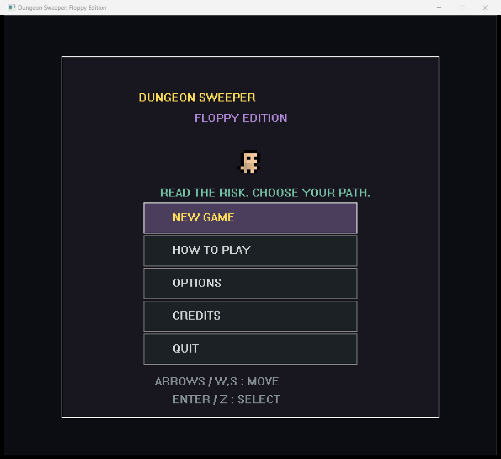
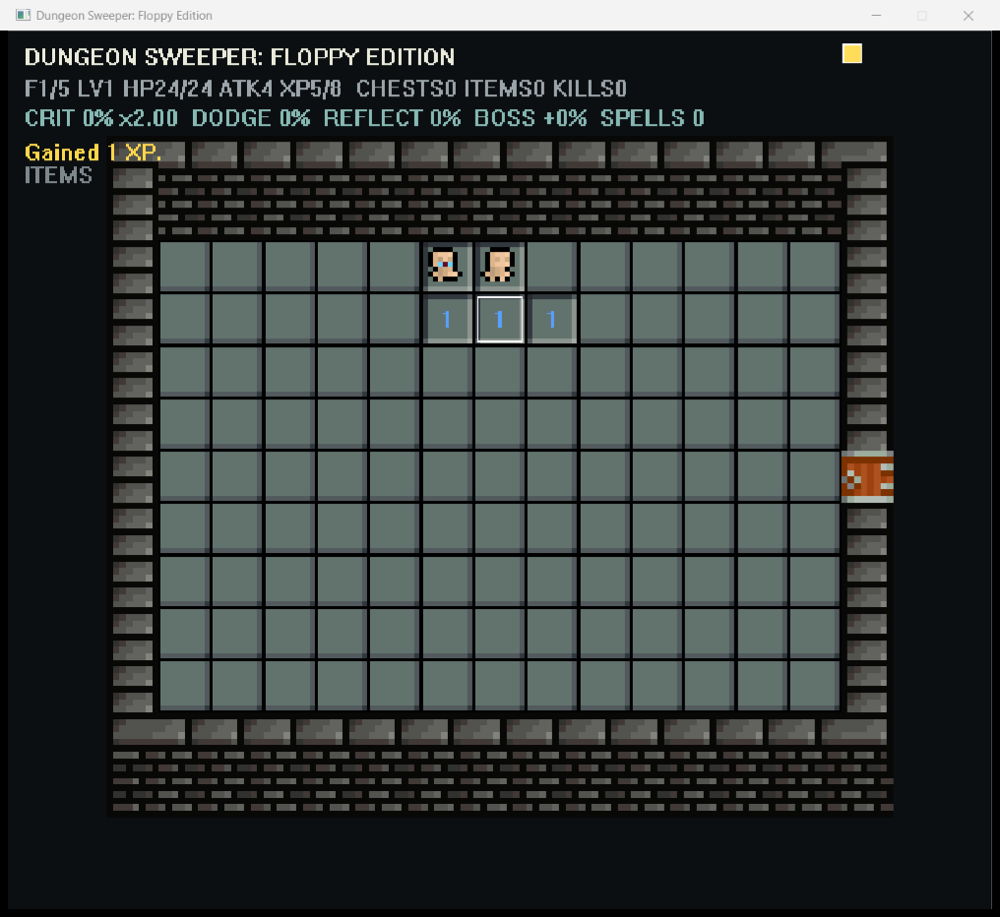

> 지뢰찾기에서 논리적으로 해결할 수 없는 위험을 ‘불합리한 즉사’가 아니라 플레이어가 감수하고 관리할 수 있는 위험으로 바꾸면 재미있는 게임이 될까?

이 질문은 내가 처음으로 만들었던 Unity 게임, **Dungeon Sweeper**의 출발점이었다. 당시에는 게임을 완성하는 것만으로도 벅찼고, 머릿속에 있던 위험과 보상의 구조를 제대로 구현하지 못했다. 리메이크하고 싶다는 생각은 오래 남아 있었지만, 규모를 키우는 방식으로 다시 시작하면 똑같이 핵심을 놓칠 것 같았다.

[1.44MB 게임 공모전](https://2pgarcade.com/contest-144mb.html)은 오히려 좋은 계기가 됐다. 용량 제한 때문에 무엇이 핵심인지 강제로 선택해야 했기 때문이다. 그래서 이번에는 콘텐츠가 많은 로그라이크를 만드는 대신, 최초의 질문 하나를 끝까지 검증하는 작은 게임을 만들기로 했다.

| 항목      | 내용                                                                   |
| --------- | ---------------------------------------------------------------------- |
| 역할      | 게임 디자인, 디렉션, 에셋 선정, 플레이테스트와 수정 기준 수립          |
| 개발 방식 | Codex와의 반복적인 AI 페어 프로그래밍으로 C++/Win32 구현               |
| 플랫폼    | Windows 독립 실행 파일                                                 |
| 최종 구성 | 5개 층, 일반 방 25개, 보스 방 5개, 일반 적 17종, 보스 5종, 아이템 20종 |
| 최종 용량 | 실행 파일 333,824바이트 / 압축 파일 110,704바이트                      |

**[게임 내려받기](../downloads/dungeonsweeperfloppy.zip)**

## 지뢰를 피해야 할 오답이 아니라 선택 가능한 위험으로 바꾸기

내가 지뢰찾기에서 문제라고 느낀 부분은 지뢰 자체가 아니었다. 충분한 정보가 없어 추측할 수밖에 없는 상황에서도 실패의 결과가 즉사라는 점이었다. 논리 게임의 규칙을 따랐는데 마지막 순간에는 운으로 생사가 갈리는 셈이다.

그렇다고 지뢰를 약한 함정으로 바꾸면 긴장감까지 사라진다. 그래서 지뢰가 있던 칸에는 **강한 몬스터**를 두었다. 잘못 열어도 즉시 게임이 끝나지는 않지만, 체력의 상당 부분을 잃을 수 있다. 중요한 차이는 플레이어가 현재 체력과 공격력을 보고 그 손실을 감당할지 결정할 수 있다는 것이다.

이 결정으로 숫자의 의미도 달라졌다. 숫자는 더 이상 피해야 할 곳만 알려주는 표지가 아니다. 위험한 칸을 정확히 읽어내면 보물상자를 얻을 수 있으므로, 동시에 성장 가능성을 알려주는 정보가 된다.

- 낮은 숫자를 따라가면 비교적 안전하지만 성장 기회가 적다.
- 높은 숫자가 모인 곳은 위험하지만 여러 상자를 만들 가능성이 높다.
- 충분히 강해진 뒤에는 몬스터일 가능성을 알면서도 일부러 칸을 열 수 있다.

내가 만들고 싶었던 실력은 지뢰의 위치를 맞히는 능력만이 아니었다. **현재 상태와 앞으로 얻을 보상을 비교해 어느 정도의 위험까지 받아들일지 판단하는 능력**이었다.

## 보상을 숫자칸이 아니라 ‘위험을 이해한 결과’에 배치하기

초기에는 열린 숫자칸 자체에서 보상을 주려고 했다. 하지만 3 이상의 숫자가 드문 지뢰찾기의 분포를 생각하면, 숫자와 보상을 일대일로 대응시키는 방식은 특정 숫자만 기다리게 만들 가능성이 컸다. 탐색 포인트 같은 별도 자원도 고려했지만 경험치와 역할이 겹쳤다.

그래서 보상의 기준을 숫자의 크기에서 **몬스터 주변의 안전한 칸을 모두 밝혔는가**로 옮겼다. 플레이어가 위험의 위치를 충분히 추론하면 몬스터가 보물상자로 바뀐다. 실수로 몬스터 칸을 먼저 열면 전투해야 하고, 정보를 끝까지 활용하면 싸우지 않고 보상을 얻는다.

이 방식이 좋았던 이유는 보상이 단순한 행운이 아니라 플레이어의 이해를 증명하기 때문이다. 숫자는 위험을 읽는 도구로 남고, 상자는 그 정보를 제대로 사용한 결과가 된다.

경험치도 같은 원칙으로 나눴다.

- 안전한 칸을 열면 작은 경험치를 얻는다.
- 몬스터를 완전히 찾아내면 추가 경험치를 얻는다.
- 직접 싸워 몬스터를 쓰러뜨리면 더 많은 경험치를 얻는다.

안전한 추론, 완전한 해결, 위험한 전투가 서로 다른 크기의 보상으로 이어지게 한 것이다.

## 성장은 정답이 아니라 다음 위험을 선택하는 근거여야 했다

단순히 레벨이 오를 때마다 공격력과 체력을 올리면 성장 과정이 자동화된다. 반대로 회복 수단이 너무 적으면 한 번의 실수가 남은 플레이 전체를 결정한다. 그래서 레벨업 때 **성장**과 **휴식** 중 하나를 선택하도록 했다.

성장을 고르면 최대 체력과 공격력이 오르고, 휴식을 고르면 최대 체력의 30%를 회복한다. 이 선택은 화려하지 않지만 현재 상태를 다시 보게 만든다. 체력이 충분하면 미래를 위해 성장하고, 다음 전투가 위험하면 당장의 생존을 택한다. 회복도 성장과 같은 자원을 소비하므로 공짜 안전망이 되지 않는다.

아이템은 Risk of Rain처럼 중첩될수록 방향성이 생기는 구조를 참고했다. 다만 낮은 숫자에는 무작위, 높은 숫자에는 좋은 아이템처럼 보상을 고정하지 않았다. 상자를 열 때마다 전체 풀에서 세 가지를 제시하고 하나를 고르게 했다. 플레이어가 독·화염·냉기·번개, 치명타, 상자, 처치, 자동 주문 같은 방향을 스스로 이어갈 수 있어야 했기 때문이다.

여기서 중요한 것은 20종이라는 개수가 아니라 **다음 선택이 이전 선택의 의미를 키우는가**였다. 시너지가 있는 아이템이 다시 등장할 가능성을 높이고, 능력치가 상한에 도달한 아이템은 후보에서 제외했다. 무작위 선택이 빌드를 방해하기보다 불완전한 선택지 안에서 방향을 만드는 역할을 하도록 했다.

## 지뢰찾기의 사고 속도와 던전 탐험의 속도를 함께 살리기

처음에는 방과 복도로 이루어진 전통적인 던전부터 만들었다. 하지만 길 위에 숫자와 지뢰를 놓는 것만으로는 지뢰찾기가 던전에 붙어 있는 장식처럼 느껴졌다. 플레이어는 숫자를 읽기보다 복도를 따라가게 됐고, 좁은 통로의 몬스터는 선택이 아니라 통행료가 됐다.

그래서 출발점을 뒤집었다. **맵은 먼저 지뢰찾기 보드이고, 플레이하면서 그 안에서 던전의 길이 드러나야 한다.** 숫자 0인 칸은 벽이나 낭떠러지로 남기고, 숫자가 있는 안전한 칸이 이동 경로가 되게 했다. 한 칸씩 여는 답답함을 줄이기 위해 안전한 칸을 공격하면 주변의 안전한 길도 함께 밝혀지도록 했다. 이동과 공개를 분리해, 방향키를 연타하는 것만으로 미지의 공간까지 돌파하지는 못하게 했다.

방 하나만으로는 탐험의 방향성이 약했기 때문에 한 층을 다섯 개의 일반 방과 하나의 보스 방으로 나눴다. 모든 칸을 열 필요는 없고, 충분히 성장했다고 판단하면 보스를 찾아갈 수 있다. 반대로 불안하면 다른 방을 더 조사할 수 있다. 이 구조가 생기면서 `탐색할 것인가, 보스에게 갈 것인가`라는 층 단위의 판단도 만들어졌다.

## 일반전은 판단의 결과로, 보스전은 성장의 시험으로

일반 몬스터와 보스에게 같은 전투를 적용했을 때 보스전이 지나치게 평평하게 느껴졌다. 하지만 모든 전투를 실시간 액션으로 만들면 숫자를 읽는 게임보다 피지컬 중심의 던전 크롤러가 될 가능성이 컸다.

그래서 역할을 분리했다.

- 일반 몬스터는 플레이어가 먼저 부딪혀야 시작되는 간단한 충돌 전투다.
- 보스는 넓은 방에서 먼저 움직이고 공격하는 실시간 전투다.

일반전은 위험한 칸을 열었다는 판단의 결과이며, 보스전은 그동안의 탐색과 아이템 선택이 충분했는지 확인하는 시험이다. 보스에게는 투사체와 범위 마법을 주어 이동할 이유를 만들었지만, 조작은 끝까지 이동과 충돌 공격으로 유지했다. 새로운 전투 버튼을 늘리는 것보다 이미 배운 조작의 의미를 바꾸는 편이 이 게임에 맞았다.

## 가장 어려웠던 것은 생성보다 ‘항상 성립하는 생성’이었다

숫자 0인 칸을 벽으로 바꾸자 방이 미로처럼 보이기 시작했지만, 새로운 문제가 생겼다. 무작위 배치 결과에 따라 시작점과 문 사이가 끊어지거나 마지막 방에 들어갈 수 없는 경우가 생겼다. 대부분의 맵이 괜찮다는 것은 절차 생성 게임에서 충분하지 않았다. 한 번이라도 진행 불가능한 맵이 나오면 그 플레이 전체가 무효가 된다.

그래서 무작위 결과를 믿는 대신 반드시 지켜야 할 조건을 따로 만들었다. 방 중앙과 모든 문을 잇는 통로를 먼저 보장하고, 그 통로는 숫자가 0이어도 벽으로 바뀌지 않게 했다. 생성 후에는 모든 방 연결과 방 내부 경로를 검사했다. 최종 빌드에서는 500개 시드에 대해 이 조건을 자동 검증한다.

여기서 배운 것은 절차 생성의 핵심이 다양한 결과를 만드는 알고리즘만은 아니라는 점이다. **플레이 가능한 결과의 경계를 먼저 정의하고, 무작위성은 그 경계 안에서만 허용해야 한다.**

## 1픽셀도 규칙으로 다루지 않으면 계속 어긋난다

가장 많은 재작업이 발생한 부분은 의외로 문과 외곽 벽이었다. 바닥은 32×32 논리 타일이지만 원본 에셋의 벽과 문은 같은 비율로 확대한다고 자연스럽게 연결되지 않았다. 문을 타일 중앙에 놓을지, 벽의 안쪽에 놓을지, 상하 문을 회전할지 같은 기준이 계속 흔들리면서 1픽셀의 어긋남이 확대 배율에서 크게 보였다.

문제는 그림을 고치는 속도가 아니라 기준 없이 수정하고 있었다는 점이었다. 이후에는 목업을 기준으로 다음 규칙을 고정했다.

- 바닥, 벽, 캐릭터의 논리적 배율을 먼저 통일한다.
- 외곽 벽은 바닥 위 오브젝트가 아니라 별도의 프레임으로 취급한다.
- 모서리는 전용 타일을 사용하고 세로 벽과 가로 벽의 우선순위를 정한다.
- 측면 문은 원본 픽셀 단위의 오프셋과 열린 상태의 방향을 명시한다.

이 경험은 작은 픽셀아트에서도 시각적 구현에는 좌표보다 **관계에 대한 규칙**이 먼저 필요하다는 것을 보여줬다. 참고 이미지를 단순한 분위기 자료로 두지 않고, 접합과 비례를 판정하는 기준으로 써야 했다.

## 용량 제한은 압축 문제가 아니라 선택의 문제였다

최종 실행 파일은 333,824바이트로 제한의 22.64%를 사용했다. 압축 해제 후 기준인 1,474,560바이트보다 1,140,736바이트 작다. ZIP은 110,704바이트다.

구현 자체는 간단하다. 엔진 없이 C++17과 Win32/GDI로 화면을 그리고, 스프라이트는 필요한 프레임만 16비트 픽셀 데이터와 무손실 RLE로 실행 파일에 내장했다. 음악 파일 대신 22.05kHz 파형 합성기와 시퀀서를 코드로 만들었고, 맵과 콘텐츠는 데이터 파일 대신 절차적으로 생성했다. 컴파일할 때도 크기 최적화와 중복 코드 제거 옵션을 사용했다.

하지만 더 중요한 이유는 따로 있다. 용량을 줄이기 위해서라기보다 **게임의 핵심과 무관한 의존성을 제거하기 위해** 이런 방법을 택했다.

- 엔진을 빼니 배포 파일을 하나로 통제할 수 있었다.
- 절차 생성을 택하니 적은 데이터로도 매번 다른 판단 상황을 만들 수 있었다.
- 음악을 코드로 만들자 파일 크기뿐 아니라 보스별 변주를 같은 동기로 묶을 수 있었다.
- 필요한 스프라이트만 고르면서 장식보다 상태 전달에 중요한 애니메이션을 우선하게 됐다.

결과적으로 1.44MB는 마지막에 압축해야 할 숫자가 아니라 개발 내내 `이 요소가 핵심 판단을 강화하는가`를 묻는 기준이 됐다.

## 플레이테스트가 드러낸 것은 설명 부족보다 잘못된 신호였다

테스트 과정에서는 작은 오해들이 반복됐다. 가보지 않은 방의 측면 문이 열린 것처럼 보였고, 처치 표시 X가 숫자와 겹쳤으며, 음량 옵션은 어떤 방향을 눌러도 증가했다. 내가 의도하지 않았던 전투 도주 기능도 조작 설명에 남아 있었다.

이 문제들은 단순한 버그처럼 보이지만 공통점이 있었다. 화면과 조작이 플레이어에게 잘못된 규칙을 말하고 있었다. 문 모양은 탐험 여부를, 숫자는 위험을, X는 전투 결과를 전달한다. 이 신호가 겹치거나 반대로 보이면 플레이어는 시스템을 이해하지 못한 것이 아니라 잘못 이해하게 된다.

그래서 `포기한 자`라는 NPC를 첫 방에 배치했다. 별도의 장황한 설명서보다 세계 안의 인물이 핵심 규칙을 말하게 하고, 조작법은 3페이지 화면으로 따로 정리했다. 마지막에는 한국어와 영어를 옵션에서 즉시 바꾸고 저장할 수 있게 했다. 현지화는 새로운 기능을 더하는 일이 아니라, 이미 만든 판단 구조를 다른 언어에서도 같은 의미로 전달하는 작업이었다.

## AI와 함께 만들면서 배운 것

나는 C++과 엔진 없는 게임 개발 경험이 없는 상태에서 시작했고, 구현은 Codex에 크게 의존했다. 대신 게임의 가설, 제거할 기능, 위험과 보상의 기준, 에셋 선택, 화면 비례와 수정 우선순위는 내가 계속 결정했다. 만들어진 빌드를 직접 플레이하고 `작동하는가`보다 `내가 의도한 판단이 생기는가`를 기준으로 수정했다.

이 과정에서 AI에게 기능 이름만 전달하는 것으로는 충분하지 않다는 것을 배웠다. 특히 시각 작업에서는 “자연스럽게”라는 표현보다 기준 이미지, 원본 픽셀 단위, 어느 레이어가 위에 와야 하는지까지 명시해야 했다. 반대로 디자인에서도 내가 판단 기준을 분명히 하지 않으면 구현 가능한 방향으로 게임이 쉽게 끌려갔다.

AI는 빠르게 많은 대안을 구현할 수 있지만, 무엇을 남기고 무엇을 버릴지는 대신 결정해주지 않는다. 이번 프로젝트에서 내 역할은 코드를 직접 입력하는 것보다 **게임이 계속 최초의 질문을 향하고 있는지 판단하는 것**에 가까웠다.

## 결과와 다음 리메이크에서 가져갈 것

Floppy Edition은 원작을 축소 이식한 게임이 아니다. 원작에서 제대로 구현하지 못했던 질문을 다시 꺼내고, 그 질문에 필요하지 않은 것을 버려 만든 두 번째 설계다.

완성된 게임에서는 플레이어가 숫자를 읽고, 몬스터를 피하거나 일부러 깨우고, 전투 대신 상자로 바꾸며, 더 탐색할지 보스에게 갈지 결정한다. 모든 선택이 완벽하게 균형 잡힌 것은 아니고 충분한 플레이테스트도 하지 못했다. 그래도 “지뢰의 가능성을 알고도 현재 상태라면 감수할 수 있다고 판단하는 순간”은 실제 플레이 안에 들어왔다.

다음 Unity 6 리메이크에서는 이 코드를 그대로 옮기기보다 이 판단 구조를 확장할 생각이다. 더 많은 아이템과 보스보다 먼저 위험을 선택한 이유와 결과를 기록하고, 어떤 숫자에서 경로를 바꾸는지, 보스 전에 얼마나 더 탐색하는지를 관찰해야 한다. 확장의 기준도 같다.

> 새로운 기능이 위험을 읽고, 선택하고, 그 대가로 성장하는 플레이를 더 풍부하게 만드는가?

그 질문에 답하지 못하는 콘텐츠라면, 정식 리메이크에서도 우선순위가 아니다.

---

그래픽 에셋은 [Krishna Palacio의 Minifantasy](https://krishna-palacio.itch.io/)를 사용했다.
